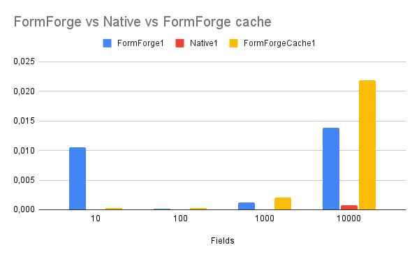

This week I've received a take home challenge for a job openning but I felt that the challenge was too simple and I couldn't show off my skills. So I created a whole project around it.

The goal of the challenge was to complete some stubbed methods of a class that generate a form. It took not more than 30 minutes to finish and there was nothing else to do really. It made me worry a bit because I wanted to be competitive and really fight for a chance of getting the job. It's an international company, meaning that I would be payed in dollar, wich in Brazil, it's a lot.But not only that, the interviews seemed genuine, something that I just felt two or three times doing interviews. That's how FormForge is born!

My intention was not to make an production ready library, the performance of it is questionable when compared against a native approach to creating a form, it falls behind some orders of magnetude versus just writing some plain HTML on a PHP file. But, you could argue that using methods is more concise and maintainable! At least consistency between forms can be archieved pretty easily.

As you can see, above we have a huge difference versus native rendering. And this is of course, caused by the overhead of using OOP. The PHP interpreter has to deal with all the abstractions, load every related class and methods to render the form. This is something inherent to the OOP software. It will be slower than functions. But, the trade-off is more maintanable code - debatable, but in most cases it's true - and better extensibility. In most libraries that use OOP you can extend code functionality and even alter it to your necessity. This makes the choice between performance and usability more feasible.

But the results of the bechmark made me think a little bit. How can I improve this numbers for our wonderful little library? Well, there's not much to do really, Im using a very small number of abstractions and theres not much you can do when dealing with strings in PHP. I've tried using Array Joining, but the performance with a small number of fields was worse. It probably would make a difference if the fields where huge strings, but in most cases they aren't, meaning that it's a pretty bad optimization.

So I written a little cache layer:

And there we go, we lowered the scores for forms with a lower number of fields! Wich in reality, thats a real world use for this library. Though it get's worse the more fields the form has. But who has a 10000 fields form? 

You can check out the Github repo here: [https://github.com/Lucasnribeiro/form-forge](https://github.com/Lucasnribeiro/form-forge)